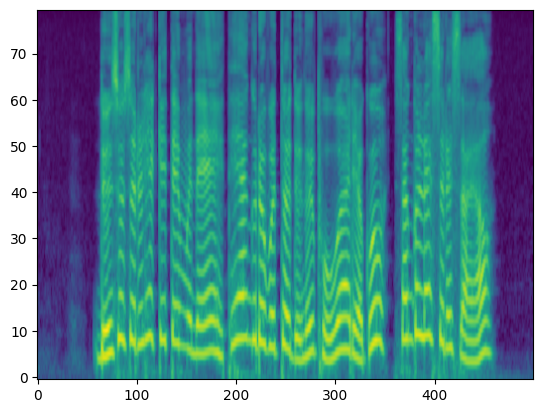
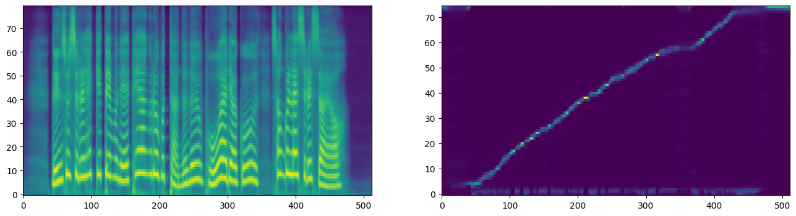

# Tacotron 2 training code using Pytorch-Lightning 

이 레포는 pytorch-lightning 프레임 워크를 사용해서, tacotron2 모델(acoustic model)을 훈련할 수 있는 코드입니다.

config 파일을 수정해서, 쉽게 훈련을 시킬 수 있습니다.

config 파일을 모듈로 세분화해서 관리하기 위해 [Hydra](https://hydra.cc/docs/intro/)를 사용했습니다.

모델 코드는 [NVIDIA/tacotron](https://github.com/NVIDIA/tacotron2)의 코드를 참고해서 작성했습니다.

[Tacotron2 모델](https://arxiv.org/abs/1712.05884)은 기본적으로 음성합성에서 텍스트 데이터를 멜 스펙트로그램으로 변환하는 acoustic 모델입니다.

데이터는 12시간의 한국어 데이터 [KSS dataset(korean-single-speaker-speech-dataset)](https://www.kaggle.com/datasets/bryanpark/korean-single-speaker-speech-dataset)를 사용했습니다.

한글 텍스트 데이터의 전처리는 [SOOHWAN KIM 님의 코드](https://github.com/sooftware/taKotron2)를 사용했습니다.


## 설치 & 훈련

1. 먼저 이 저장소를 클론합니다.

```bash
git clone https://github.com/your-username/tacotron2.git

```
2. python package를 설치합니다.

```bash
pip install -r requirements.txt
```
3. kss 데이터를 path에 준비합니다.

4. config값을 원하는 값으로 수정합니다.

5. train 코드 실행해서 훈련을 시작합니다.

```bash
python3 ./src/train.py
```

## 추론 & 결과

Text: 눈 수술을 했기 때문에 태양으로부터 눈을 보호하려고 선글라스를 써요.

Normalized Text: 눈 수수를 핻끼 때무네 태양으로부터 누늘 보호하려고 선글라스를 써요~






## 참조
https://github.com/NVIDIA/tacotron2
https://www.kaggle.com/datasets/bryanpark/korean-single-speaker-speech-dataset
https://github.com/sooftware/taKotron2